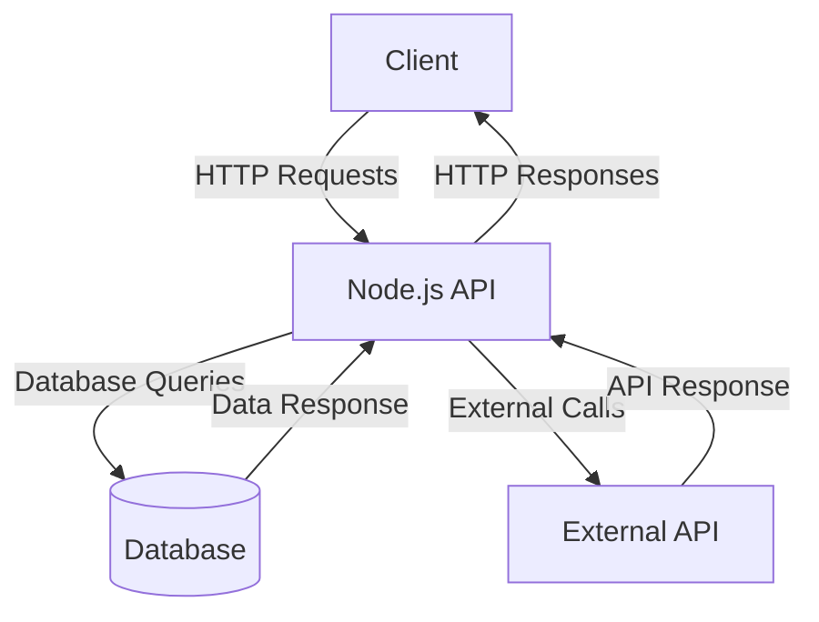
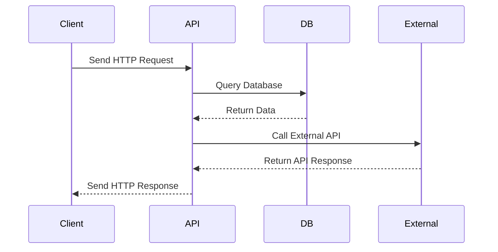

# Sample Node.js Application

This document provides an overview of a sample Node.js application, including its architecture and workflow. The application is designed to demonstrate best practices in Node.js development.

## Application Architecture

The following diagram illustrates the architecture of the Node.js application:



## Workflow

The workflow of the application is depicted below:



## Features

- **RESTful API**: Built using Express.js for handling HTTP requests.
- **Database Integration**: Supports MongoDB for data storage.
- **External API Integration**: Fetches data from third-party APIs.
- **Error Handling**: Implements robust error handling mechanisms.

## Getting Started

To run the application locally, follow these steps:

1. Clone the repository:
   ```bash
   git clone https://github.com/your-repo/sample-nodejs-app.git
   cd sample-nodejs-app
   ```

2. Install dependencies:
   ```bash
   npm install
   ```

3. Start the application:
   ```bash
   npm start
   ```

4. Access the application at [http://localhost:3000](http://localhost:3000).

## Reference Links

- [Node.js Documentation](https://nodejs.org/en/docs/)
- [Express.js Guide](https://expressjs.com/)
- [MongoDB Documentation](https://www.mongodb.com/docs/)
- [Mermaid Documentation](https://mermaid-js.github.io/mermaid/#/)
